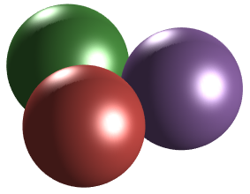

# `mexjulia`: embedding [Julia](http://julialang.org/) in the [MATLAB](http://www.mathworks.com/products/matlab/) process.

Note: this project is effectively in hibernation as its author no longer has access to matlab.

## Prerequisites

`mexjulia` requires MATLAB (tested with R2016b) and Julia (>=v.0.6-dev) along with a C++ compiler configured to work with MATLAB's `mex` command, the last is required for building the `mexjulia` MEX function. You can check that a compiler is properly configured by executing:

```
>> mex -setup C++
```

from the MATLAB command prompt.

## Configuration

Start MATLAB and navigate to the `mexjulia` directory. Once there, run:

```
>> jl.config
```

You will be prompted to select a `julia` executable. The build process will:
 1. use `julia` to determine build options,
 1. build the `mexjulia` MEX function from source,
 1. add the `mexjulia` directory to your MATLAB path.

Call `jl.config` any time you want to build against a different version of Julia. You can
pass in the path to the desired Julia executable to build against if you don't want
to be prompted to select one.

## Quick start

Use `jl.eval` to parse and evaluate MATLAB strings as Julia expressions:

```
>> jl.eval('2+2')

ans =

  int64

   4
```

You can evaluate multiple expressions in a single call:

```
>> [s, c] = jl.eval('sin(pi/3)', 'cos(pi/3)')

s =

    0.8660


c =

    0.5000
```

Julia's `STDOUT` and `STDERR` are redirected to the MATLAB console:

```
>> jl.eval('println("Hello, world!")');
Hello, world!
>> jl.eval('warn("Oh, no!")');
WARNING: Oh, no!
```

One can avoid the parentheses and string quotes using `jleval` (a simple wrapper around
`jl.eval`) and MATLAB's command syntax:

```
>> jleval 1 + 1

ans =

  int64

   2

>> jleval println("Hello, world!")
Hello, world!
```

Use `jl.call` to call a Julia function specified by its name as a string:

```
>> jl.call('factorial', 10)

ans =

     3628800
```

`jl.call` marshals MATLAB data to/from Julia making certain default choices for doing so.

Load new Julia code by calling `jl.include`:

```
>> jl.include('my_own_julia_code.jl')
```

Exercise more control over how data is marshaled between MATLAB and Julia by defining
a Julia function with a "MEX-like" signature and invoking it with `jl.mex`:

```
>> jleval double_it(args::Vector{MxArray}) = [2*jvalue(arg) for arg in args]
>> a = rand(5,5)

a =

    0.6443    0.9390    0.2077    0.1948    0.3111
    0.3786    0.8759    0.3012    0.2259    0.9234
    0.8116    0.5502    0.4709    0.1707    0.4302
    0.5328    0.6225    0.2305    0.2277    0.1848
    0.3507    0.5870    0.8443    0.4357    0.9049

>> jl.mex(1, 'double_it', a)

ans =

    1.2886    1.8780    0.4155    0.3895    0.6222
    0.7572    1.7519    0.6025    0.4518    1.8468
    1.6232    1.1003    0.9418    0.3414    0.8604
    1.0657    1.2450    0.4610    0.4553    0.3696
    0.7015    1.1741    1.6886    0.8714    1.8098
```

The first argument to `jl.mex` is the number of return values to expect. The second is the name of the function to be invoked. All remaining arguments are treated as function arguments. `jl.mex` expects the functions on which it is invoked to accept a single argument of type `Vector{MxArray}` and to return an iterable collection of values on which `mxarray` may be successfully invoked (_e.g._, a value of type `Vector{MxArray}`).

See [`lmdif_test.m`](examples/lmdif_test.m), [`lm.m`](examples/lmdif.m), and [`lmdif.jl`](examples/lmdif.jl) for a more complex example that exposes [`Optim.jl`](https://github.com/JuliaOpt/Optim.jl)'s Levenberg-Marquardt solver to MATLAB. It presents an example of a MATLAB function handle being passed to Julia and used as a
callback. (The default marshaling wraps matlab function handles in an anonymous function.)

## Known Issues

 - On Windows, if a julia is on the path it must be the one against which `mexjulia` is built.
